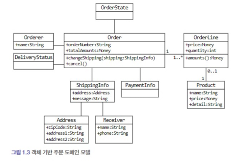
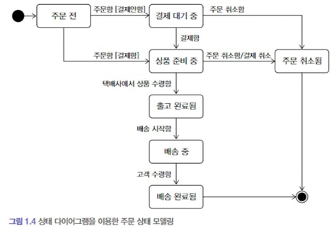
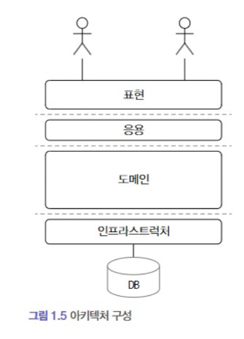

# 도메인이란?

- 소프트웨어로 해결하고자 하는 문제영역
    - 예를 들면 11번가는 오픈 마켓 이라는 도메인을 가지고있음

## 하위도메인?

- 위의 예시를 이어서 오픈 마켓이라는 도메인 내에는 여러가지 하위 도메인이 있다.
    - ex) 상품, 셀러, 광고, 추천 등등...
- 여기서 특정 도메인을 위한 소프트웨어를 모두 직접 구현하는 것은 아니다.
    - 예를 들어 결제와 같은 특정 도메인 같은 것들은 외부 업체에 맡길수도 있다.

## 도메인 전문가와 개발자 간의 지식 공유

- 개발을 함에있어 요구사항을 올바르고 또 명확하게 이해한후에 해야한다 그렇지 않으면 잘못된 설계로 인해 잘못된 결과가 나오기 때문이다.
- 업무를 할때 중요했던점
    - 해당 요구사항이 필요한 이유를 한번 여쭤보자
        - 내가 생각했던것과 다르거나 혹은 더좋은 방법이 있을지도 모른다.
        - 그들이 진짜 원하는 것을 찾아야한다.
    - 어느정도 도메인 지식을 갖추어야 이야기가 된다

## 도메인 모델

- 기본적으로 도메인 모델은 특정 도메인을 개념적으로 표현한것
    - 모델은 도메인의 모든내용을 담고있지는 않다
    - 여기서 객체를 이용한 도메인 모델을 이용하면 시각적으로 기능과 데이터를 한번에 보여주기때문에 편리하다.
        - 
    - 또다른 상태 다이어 그램을 이용하면 객체의 상태 전이를 살펴볼수있다.
        - 
    - 이런 다이어그램 뿐만아니라 계산식,차트와 같은 다양한 방법으로 도메인을 이해하기 위한 표현방식이다.

## 도메인 모델 패턴

- 일반적인 애플리케이션 아키텍처
    - 
    - | 영역                              | 설명                                     |
          |---------------------------------|----------------------------------------|
      | 사용자 인터페이스 또는 표현 (controller 느낌) | 사용자의 요청을 처리하고 정보를 보여주는 일종의 포트          |
      | 응용 (service 들을 통합하는 facade 느낌)  | 사용자가 요청한 기능을 실행 도메인 계층을 조합해서 기능을 실행한다. |
      | 도메인 (service)                   | 시스템이 제공할 도메인 규칙을 정함                    |
      | 인프라 (repository)                | DB나 메세징업무 같은 외부 시스템과의 연동처리             |

      - 여기서 도메인과 관련된 중요 업무 규칙 같은 것들은 응용계층이 아니라 도메인 계층에 구현한다.
        - 이렇게 했을때 장점은 도메인 규칙은 모델에만 있기때문에 수정 범위가 줄어든다.