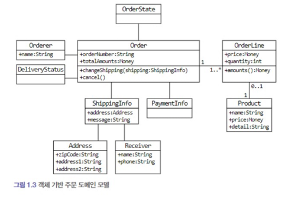
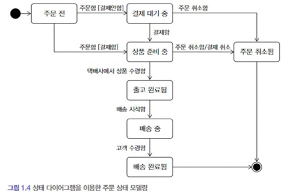
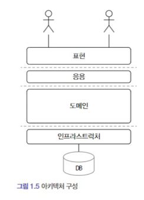

# 도메인이란?

- 소프트웨어로 해결하고자 하는 문제영역
    - 예를 들면 11번가는 오픈 마켓 이라는 도메인을 가지고있음

## 하위도메인?

- 위의 예시를 이어서 오픈 마켓이라는 도메인 내에는 여러가지 하위 도메인이 있다.
    - ex) 상품, 셀러, 광고, 추천 등등...
- 여기서 특정 도메인을 위한 소프트웨어를 모두 직접 구현하는 것은 아니다.
    - 예를 들어 결제와 같은 특정 도메인 같은 것들은 외부 업체에 맡길수도 있다.

## 도메인 전문가와 개발자 간의 지식 공유

- 개발을 함에있어 요구사항을 올바르고 또 명확하게 이해한후에 해야한다 그렇지 않으면 잘못된 설계로 인해 잘못된 결과가 나오기 때문이다.
- 업무를 할때 중요했던점
    - 해당 요구사항이 필요한 이유를 한번 여쭤보자
        - 내가 생각했던것과 다르거나 혹은 더좋은 방법이 있을지도 모른다.
        - 그들이 진짜 원하는 것을 찾아야한다.
    - 어느정도 도메인 지식을 갖추어야 이야기가 된다

## 도메인 모델

- 기본적으로 도메인 모델은 특정 도메인을 개념적으로 표현한것
    - 모델은 도메인의 모든내용을 담고있지는 않다
    - 여기서 객체를 이용한 도메인 모델을 이용하면 시각적으로 기능과 데이터를 한번에 보여주기때문에 편리하다.
        - 
    - 또다른 상태 다이어 그램을 이용하면 객체의 상태 전이를 살펴볼수있다.
        - 
    - 이런 다이어그램 뿐만아니라 계산식,차트와 같은 다양한 방법으로 도메인을 이해하기 위한 표현방식이다.

## 도메인 모델 패턴

- 일반적인 애플리케이션 아키텍처
    - 
    - | 영역                              | 설명                                     |
          |---------------------------------|----------------------------------------|
      | 사용자 인터페이스 또는 표현 (controller 느낌) | 사용자의 요청을 처리하고 정보를 보여주는 일종의 포트          |
      | 응용 (service 들을 통합하는 facade 느낌)  | 사용자가 요청한 기능을 실행 도메인 계층을 조합해서 기능을 실행한다. |
      | 도메인 (service)                   | 시스템이 제공할 도메인 규칙을 정함                    |
      | 인프라 (repository)                | DB나 메세징업무 같은 외부 시스템과의 연동처리             |

      - 여기서 도메인과 관련된 중요 업무 규칙 같은 것들은 응용계층이 아니라 도메인 계층에 구현한다.
        - 이렇게 했을때 장점은 도메인 규칙은 모델에만 있기때문에 수정 범위가 줄어든다.

## 도메인 모델 도출
- 개발전에 도메인을 이해하고 연필이나 화이트보드 등을 이용해서 도메인 초기 모델 도출이 필요하다.
- 개략적인 순서를 보자면
  - 요구사항 분석
  - 요구사항 분석을 토대로 인터페이스 및 도메인 객체 생성잉 가능하다.
  - 제약과 조건을 추가한다.
- 이렇게 했을때 기본적인 도메인 모델을 만들수있다.
  - 추후에 다른 개발자나 도메인 전문가와 논의하는 과정에서 수정해나간다.

### 문서화?
- 지식을 공유하기 위함이다. 코드로 모든 지식들을 공유하기는 힘들기 때문이다.
- 개취콘 발췌
  - 글을 정말 잘쓰는 사람도 100퍼센트의 내용을 전달하지 못한다고 생각하기 때문에 요구사항 분석같은 경우는 도메인 전문가, 개발자, 기회자등 전문가들이 모여서 직접 말하면서 함께 정의하고 수정하는것이 더 효율적인것 같음

## 엔티티와 밸류
- 엔티티
  - 고유 식별자를 가짐
  - 따라서 고유식별자로 객체를 구분하며 다른속성을 변경하더라도 고유식별자는 그대로 유지됌
  - 엔티티는 식별자(ID)에 의해 구별되며, 일반적으로 가변(mutable), 엔티티는 주로 복잡한 비즈니스 로직이나 도메인 개념을 나타내는 데 사용됌
- 밸류 (값)
  -  값 객체는 그 자체로 의미를 가지며, 변경 불가능(immutable)해야 한다. 값 객체는 주로 단순한 데이터,상태등을 나타내는 데 사용됌
- 엔티티 식별자 생성전략
  - 특정 규칙에 따라 생성 (주민번호,배송번호 등등)
  - DB의 sequence를 이용해서 생성(일련번호)
  - UUID,NanoID를 이용해서 생성
  - 값을 직접 입력하는 경우(유저 ID, email 등등)

- DTO는 값 객체로 볼수있나?
  - 값 객체(Value Object): 값 객체는 불변성(Immutability)을 가지며, 동일성은 구조적 동일성(Structural Equality)에 의해 판단된다. 즉, 모든 속성이 동일하면 같은 객체로 간주함
  - DTO(Data Transfer Object): DTO는 불변성을 가질 필요가 없으며, 주로 데이터 전송을 위한 용도로 사용됩니다. DTO는 일반적으로 동일성 판단이 필요하지 않는 것이 대부분이다.

### setter 메서드 지양하기
- 도메인의 핵심 개념이나 의도를 코드에서 사라지게 한다.
  - 예를 들어 주문의 상태를 변경하는 메서드가 있고 이 메소드의 이름을 changeOrderStatus라고 한다면 setOrderStatus보다 훨씬 명확하게 주문의 상태를 변경한다는 의도를 코드에서 알 수 있다
  - 또한 도메인 객체를 생성할때 온전한 상태로 생성할 수 없다.

## 도메인 용어와 유비쿼터스 언어
- 도메인 용어를 코드에 녹여내자
- 도메인 용어를 문서에 반영하고 최신화 하여 구성원도 잘알수있도록 관리하자
- 의미 없는 이름의 변수나 메서드를 지양하자 ex) gubun(구분)