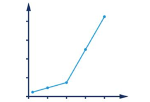
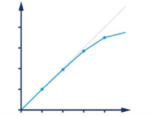
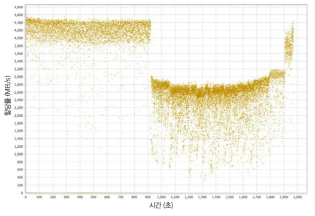
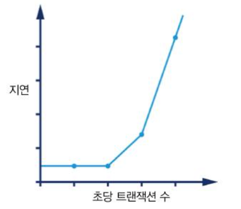

# 성능과 최적화
- 성능 분석은 것은 경험주의와 질퍽한 인간 심리학이 교묘히 어우러진 분야이다.
## 자바 성능 : 잘못된방법
- 옛날의 자바는 디스패치(메서드호출) 성능이 최악이어서 메서드 하나에 크게 로직을 넣어 두는것이 좋다고 권고하는 사람들이 많았다.
  - 이런 방식은 코드를 이해하기 어렵게 만들고, 유지보수를 어렵게 만든다.
  - 현대의 JVM은 자동 인라이닝을 통해서 가상 디스패치조차 대부분의 호출부에서 사라지게 됬다.
> JVM을 더 빨리 작동시키는 '마법의 스위치는 없다.'  
> 자바를 더 빨리 실행하게 만드는 '팁,트릭'은 없다.  
> 사용자가 못 보게 꼭꼭 숨겨둔 '비밀 알고리즘'도 없다.

## 자바 성능 개요
> 자바는 블루 칼라(주로 생산직에 종사하는 육체 노동자) 언어 입니다. 박사 학위 논문 주제가 아니라 일을 하려고 만든 언어죠 - 제임스 고슬링
- 자바가 최근들어 고성능 컴퓨팅 애플리케이션에 적합한 수준에 이르게 된건 핫스팟,GraalVM과 같은 가상머신의 발전 덕분이다.
- 자바 플랫폼은 실용주의로 대표적인 것은 서브시스템이다.
  - 예를들어 메모리 관리가 그렇다 JVM이 알아서 메모리를 관리해주기 때문에 개발자는 메모리 관리를 신경쓰지 않아도 된다.
### 불편한 진실
- JVM 애플리케이션을 측정해보면 성능 측정값이 정규 분포를 따르지 않는 경우가 많다. 때문에 기초 통계로 측정결과를 추측하기는 힘들다.
  - 예를 들어 저지연 애플리케이션에서 특히 특이점은 매우 중요한 의미를 내포하는데 측정값을 샘플링하면 특이점을 일으킨 중요한 이벤트가 묻힐가능성이 크다.
  - 즉 작은 포인트가 중요하지만 평균적인 성능 측정값을 가지고는 정확한 결론을 내리기 어렵다.
  - 이러한 것들을 보아 자바의 측정값 때문에 판단이 흐려지기 쉽기 때문에 항상 주의 해야한다.
  - 측정 행위 자체도 오버헤드를 일으키며 자주 샘플링하거나 하면 성능 결과에 영향을 준다.
    - 예를 들어 yourkit 같은 프로파일러를 이용해서 측정을 할 때 이는 꽤 큰 리소스를 소비하는데 성능 측정과 함께 할 경우 제대로된 성능측정을 하기 힘들 수 있다.

## 성능은 실험과학이다.
- JVM의 성능튜닝을 하기위해 해야하는 단계
  1. 성능 목표를 설정한다.(원하는 결과 정의)
  2. 기존 시스템을 측정한다.
  3. 요건을 충족시키려면 무슨 일을 해야 하는지 결정한다.
  4. 개선 활동을 추진한다.
  5. 다시 측정한다.
  6. 목표를 달성했는지 확인한다.

> 즉 성능 분석은 닭을 해부해보거나 점을 치는 과정이 아니라, 통계치에 근거해 적절히 결과를 처리하는 활동이다.

## 성능분류
### 가장 기본적인 성능지표 7가지
- 처리율(throughput) : 단위 시간당 수행가능한 작업 비율
  - 예시 초당 처리가능한 트랜잭션 수 TPS
  - 이 지표가 의미있는 데이터가 되기위해서는 해당 수치를 얻은 플랫폼에 대해서 기술을 해야한다. (현재 컴퓨터 스펙, OS, 테스트 시스템 클러스터 유무 등등 )
  - 또 트랜잭션은 테스트 할때 마다 동일해야한다.
- 지연(latency) : 하나의 트랜잭션의 수행 소요 시간
- 용량(capacity) : 시스템이 보유한 작업 병렬성의 총량, 즉 시스템이 동시 처리 가능한 작업 단위 개수를 말한다.
  - 처리율과 밀접한 관련이 있음
- 사용률(utilization) : 시스템 리소스를 효율적으로 활용하는지 에 대한 지표
  - cpu 바운드 한 프로그램인 경우 cpu 사용률은 높지만 메모리 사용률은 낮음 (ex 그래픽 처리,암호화...)
- 효율(efficiency) : 처리율을 리소스 사용률로 나눈 값으로 측정함
  - 같은 처리율을 처리하는데 더 많은 리소스를 사용하는 것은 효율이 낮은 것
- 확장성(scalability) : 리소스 추가에 따른 처리율 변화를 말함
  - 예를 들어 서버를 2대 늘리거나 클러스터를 2배 확장하는 등의 행위를 했을때 처리율이 2배가 될까 ?
  - 리소스를 투입한만큼 처리율이 얼마나 달라지는가?
- 저하(degradation) : 부하에 따라서 생기는 지연(처리율 하락 또는 횡보)이 생기는 현상을 말함
  - 시스템리소스를 최대로 사용하지만 처리율이 더늘지 않는 현상 => 지연발생 => 저하현상

### 측정값 사이의 연관관계
**위의 지표들은 서로 연결되있다. 예를 들어 어떤 지표가 상승하면 다른 지표도 함께 상승하거나 혹은 하락하는 관계를 뜻한다.**
- 예를들면 부하가 증가할때 시스템 사용률도 달라지지만, 시스템을 많이 사용하지 않는 시간에는 부하가 늘어도 사용륭은 별로 눈에 띄게 증가하지 않을 수도 있음 반대로 이미 부하가 많은 경우는 부하가 조금만 늘어도 측정값들이 크게 요동칠수있음

## 성능 그래프 읽기
- **성능 엘보**
  - 부하가 증가하면서 예기치 않은 지연이 발생하는 현상
  - 
- **준 선형적 확장**
  - scale out, 클러스터링을 통한 선형적인 처리율 확장 아래의 그림은 아주 운이 좋은 케이스로 실제로는 이렇게 선형적으로 확장되지 않는다.
  - 추가적으로 이런 scale out 의 경우는 세션 어피니티가 필요 없는 상태일 때나 가능하다.
  - 
- **메모리 할당 그래프**
  - 가비지 수집에 대해서 문제가 발생하면 가비지를 수집하는 스레드들이 서로 cpu 경합을 하게되고 이로인해 메모리를 충분히 할당 받지 못한다.
  - 
- **부하가 높을 때 상당한 지연 발생**
  - 부하 지표가 차츰 악화 되다가 성능이 급락하는 변곡점에 이르게 됌 => 장애
  - 보통은 리소스 누수현상으로 인해 발생
  - 
