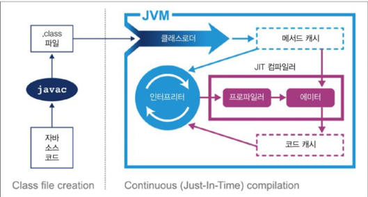

# JVM 이야기
- 성능에 관심이 있는 개발자라면 기본적으로 JVM 기술 스택의 구조를 이해해야한다.
- 그래야 성능 이슈를 탐구할대 필요한 이론적 배경지식을 토대로 성능 이슈를 해결할 수 있다.

## 인터프리팅과 클래스 로딩
- JVM 인터프리터의 기본로직은 while 루프 안의 switch문과 비슷하다고 생각하면 된다.
  - `switch(opcode) { case 0: ... case 1: ... case 2: ... }`
- 자바의 클래스로딩
  - main() 메서드를 실행하려면 해당클래스로 제어권을 넘겨야 하고 그러기 위해서는 가상머신 실행전에 해당 클래스를 로드해야 한다.
  - `Bootstrap ClassLoader`
    - 가상머신이 실행되면 가장 먼저 Bootstrap ClassLoader가 실행되고, 이 클래스로더는 rt.jar에 있는 클래스들을 로드한다.
    - rt.jar에 있는 클래스들은 java.lang 패키지에 있는 클래스들이다.
  - `Extension ClassLoader`
    - Bootstrap ClassLoader가 생성 된 후 Extension ClassLoader가 생성된다.
    - Extension ClassLoader는 JAVA_HOME/jre/lib/ext에 있는 클래스들을 로드한다.
  - `System ClassLoader`
    - Extension ClassLoader가 생성 된 후 System ClassLoader가 생성된다.
    - System ClassLoader는 애플리케이션 클래스패스에 있는 클래스들을 로드한다.
  - 룩업 순서 : System ClassLoader -> Extension ClassLoader -> Bootstrap ClassLoader
    - Bootstrap ClassLoader도 해당 클래스를 찾지 못한경우 ClassNotFound 예외를 발생시킨다.
- 바이트 코드 실행 순서
  - 자바코드 => javac(컴파일러) => 바이트코드(.class 중간표현형) => JVM(인터프리터) => 기계어
- 클래스파일 구조
  - 매직 넘버 : 0xCAFEBABE
  - 자바 파일 포맷버전 : 자바의 마이너/메이저 버전
  - Constant Pool : 상수풀
      - 상수풀은 클래스파일의 상수들을 모아놓은 테이블이다
      - 런타임에 메모리 대신 상수 풀 테이블에서 필요한 값을 참조
      - 상수풀은 클래스파일의 특정위치를 가리키는데, 이 특정위치는 클래스파일의 레이아웃을 따른다
      - 상수풀은 두가지 종류의 상수로 구성되어 있다
        - `리터럴 상수`
          - 리터럴 상수는 클래스파일에 직접적으로 나타나는 상수이다.
          - 예를들어, `String str = "hello";` 에서 "hello" 문자열이 리터럴 상수이다.
        - `심볼릭 상수`
          - 심볼릭 상수는 리터럴 상수의 주소를 가리키는 상수이다.
          - 예를들어, `String str = "hello";` 에서 str은 "hello" 문자열의 주소를 가리키는 심볼릭 상수이다.
  - Access Flag : 추상 클래스, 인터페이스 등 클래스 종류 표시
  - This Class : 현재 클래스명
  - Super Class : 상위 클래스명
  - Interfaces : 클래스가 구현한 모든 인터페이스
  - Fields : 클래스에 들어있는 모든 필드
  - Methods : 클래스에 들어있는 모든 메서드
  - Attributes : 클래스에 들어있는 모든 속성 (소스 파일명)
- 핫스팟 입문
  - 핫스팟 JVM
  - 

  - 자바의 장점 이식성이 좋음, 핫스팟은 프로그램의 런타임 동작을 분석하고 성능에 유리한 방향으로 최적화를 수행한다. (warm up이 필요한 이유)
  - **JIT 컴파일러란 무엇인가 ?**
    - 자바는 인터프리터가 가상화한 스택 머신에서 명령어를 실행하며 시작된다. 하지만 성능을 최대로 내기 위해서는 네이티브 코드 자체를 활용해 바로 cpu에 직접 실행 하는것이 빠르다.
    - 이를 위해 JIT 컴파일러는 인터프리터가 반복적으로 수행되는 코드를 발견하면 JIT 컴파일러가 해당 코드를 네이티브 코드로 컴파일한다.
      - 이 과정도 사실 여러단계로 나뉜다. C1,C2 컴파일러가 존재하고 tired compilation이라는 개념도 존재한다.
    - profile를 통해서 실제 수행되는 코드를 분석하고, 이를 바탕으로 최적화를 수행하는 것은  C2 컴파일러다.
    - 이로 인해서 JIT 컴파일 후 실행되는 코드는 원본과 다를 가능성이 있다.
  - **JAVA의 메모리 관리**
    - C에 비슷한 기능으로 스마트 포인터가 있음
    - 가비지 컬렉션이라는 프로세스를 이용해서 힙 메모리를 자동으로 관리함
    - GC시에는 모든 스레드가 멈추고 GC에 할당되는 STW 라는 이벤트가 발생함
  - **스레딩과 자바 메모리모델(JMM)**
    - 현재 주류 자바 JVM 구현체의 스레드는 OS와 1대1로 대응된다.
    - 자바 멀티스레드 원칙
      - 1. 공용힙을 가진다. (GC)
        2. 한 스레드가 생성한 객체는 그 객체를 참조하는 다른스레드가 액세스 수 있다.
        3. 기본적으로 객체는 변경 가능하다. (final이 아닌 이상)
    - 공용힙에서는 같은 객체를 두개의 스레드가 참조하는 레이스 컨디션이 발생할 수 있음
