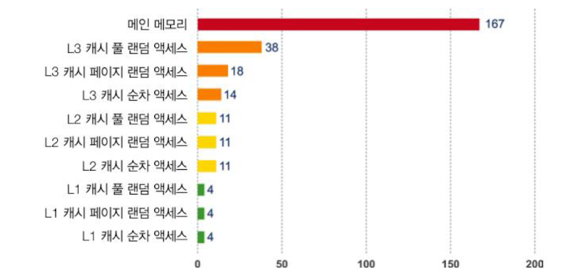

# 하드웨어와 운영체제
- 무어의 법칙은 깨졌다.
- 자바는 하드웨어의 발전에 많은 혜택을 받았다.
- 지금은 소프트웨어의 시대다.

## 최신 하드웨어 소개
### 메모리
- 처음에 트랜지스터는 클록 속도를 높이는데 쓰였다.
  - cpu 클럭속도는 빨라지는 반면 메모리의 속도는 그만큼 빨라지지 못해서 cpu의 사용률이 낮아졌다.
- **메모리 캐시**
  - 위의 메모리 - cpu간의 속도차이를 극복하기 위해 (L1 L2 L3)메모리 캐시가 등장했다.
  - 레지스터 보다 느리고 메인 메모리 보다는 빠르다.
  - 
  - 캐시 아키텍처를 이용해서 액세스 시간을 줄였다.
  - 캐시의 문제점
    - 병렬처리 환경에서 캐시 일관성 문제가 발생한다.
    - MESI 프로토콜을 이용해서 일관성 문제를 해결했음 (최근에는 O를 추가한 MOESI 프로토콜을 사용한다.)
      - M(Modified): 데이터가 수정된 상태 다른캐시에는 존재하지 않고 현재 캐시에만 존재 메인 메모리에 존재하지 않는 상태
      - E(Exclusive): 이 캐시에만 존재하고 메인 메모리 내용과 동일한 상태
      - S(Shared): 둘 이상의 캐시에 데이터가 들어있고 메인 메모리 내용과 동일한 상태
      - I(Invalid): 다른 프로세스가 데이터를 수정하여 무효화된 상태
      - O(Owned): 메모리에 write-back 하지 않은 상태에서 다른 캐시가 해당 라인을 share 하는 상태이다. (데이터를 요청한 캐시에 데이터를 CCI를 통해 다이렉트로 전달해서 캐시끼리는 데이터가 같지만 메인 메모리와는 다른상태)
    - 기본적인 흐름 : M -> E -> S -> I -> M
  - 캐시 쓰기 전략
    - write-through (요즘 거의 안씀)
      - 메모리와 캐시에 동시에 쓰기를 한다.
      - 캐시와 메모리에 동시에 쓰기를 하기 때문에 대역폭을 많이 소모해서 효율이 떨어진다.
      - 캐시 일관성 문제가 발생하지 않는다.
    - write-back
      - 캐시에만 쓰기를 하고 메모리는 나중에 쓴다.
      - 캐시에만 쓰기를 하기 때문에 쓰기 성능이 높다.
      - 캐시 일관성 문제가 발생한다.
  - 최신 프로세서의 특성
    - TLB(Translation Lookaside Buffer) : 가상 메모리 주소를 물리 메모리 주소로 변환하는데 사용하는 페이지 테이블의 캐시 역할을 수행한다.
    - **분기 예측과 추측 실행**
      - 
