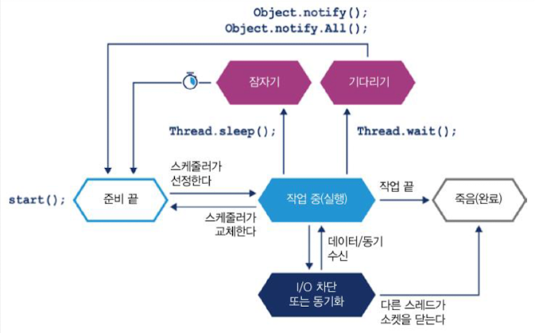

# 하드웨어와 운영체제
- 무어의 법칙은 깨졌다.
- 자바는 하드웨어의 발전에 많은 혜택을 받았다.
- 지금은 소프트웨어의 시대다.

## 최신 하드웨어 소개
### 메모리
- 처음에 트랜지스터는 클록 속도를 높이는데 쓰였다.
  - cpu 클럭속도는 빨라지는 반면 메모리의 속도는 그만큼 빨라지지 못해서 cpu의 사용률이 낮아졌다.
- **메모리 캐시**
  - 위의 메모리 - cpu간의 속도차이를 극복하기 위해 (L1 L2 L3)메모리 캐시가 등장했다.
  - 레지스터 보다 느리고 메인 메모리 보다는 빠르다.
  - 
  - 캐시 아키텍처를 이용해서 액세스 시간을 줄였다.
  - 캐시의 문제점
    - 병렬처리 환경에서 캐시 일관성 문제가 발생한다.
    - MESI 프로토콜을 이용해서 일관성 문제를 해결했음 (최근에는 O를 추가한 MOESI 프로토콜을 사용한다.)
      - M(Modified): 데이터가 수정된 상태 다른캐시에는 존재하지 않고 현재 캐시에만 존재 메인 메모리에 존재하지 않는 상태
      - E(Exclusive): 이 캐시에만 존재하고 메인 메모리 내용과 동일한 상태
      - S(Shared): 둘 이상의 캐시에 데이터가 들어있고 메인 메모리 내용과 동일한 상태
      - I(Invalid): 다른 프로세스가 데이터를 수정하여 무효화된 상태
      - O(Owned): 메모리에 write-back 하지 않은 상태에서 다른 캐시가 해당 라인을 share 하는 상태이다. (데이터를 요청한 캐시에 데이터를 CCI를 통해 다이렉트로 전달해서 캐시끼리는 데이터가 같지만 메인 메모리와는 다른상태)
    - 기본적인 흐름 : M -> E -> S -> I -> M
  - 캐시 쓰기 전략
    - write-through (요즘 거의 안씀)
      - 메모리와 캐시에 동시에 쓰기를 한다.
      - 캐시와 메모리에 동시에 쓰기를 하기 때문에 대역폭을 많이 소모해서 효율이 떨어진다.
      - 캐시 일관성 문제가 발생하지 않는다.
    - write-back
      - 캐시에만 쓰기를 하고 메모리는 나중에 쓴다.
      - 캐시에만 쓰기를 하기 때문에 쓰기 성능이 높다.
      - 캐시 일관성 문제가 발생한다.
  - 최신 프로세서의 특성
    - TLB(Translation Lookaside Buffer) : 가상 메모리 주소를 물리 메모리 주소로 변환하는데 사용하는 페이지 테이블의 캐시 역할을 수행한다.
    - **분기 예측과 추측 실행**
      - 분기 예측 : 프로세스가 조건 분기하는 기준 값을 평가하느라 대기하는 현상
          - 분기 예측이 성공하면 파이프라인에 있는 명령어를 취소하지 않고 계속 실행한다.
          - 분기 예측이 잘못되면 파이프라인에 있는 명령어를 모두 취소하고 다시 실행해야 하기 때문에 성능이 떨어진다.
      - 추측 실행 : 성능을 위해서 다음 실행될 명령어 예측하여 먼저 실행하는 기법
        - cpu의 OoOE(Out-of-Order Execution) 기능을 이용해서 다음 실행될 명령어를 미리 실행한다.
        - 명령어를 미리 실행하다가 분기 예측이 틀리면 취소한다.
      - 문제점
        - 멜트다운(추측실행,OoOE), 스펙터(분기예측) 취약점이 발견되었음
          - 멭트 다운 : 커널의 메모리를 읽어오는 취약점
            - 캐시의 특성과 OoOE 기능을 이용해서 커널의 메모리를 읽을수 있다.
            - 먼저 OoOE를 이용해서 현재 모드(커널모드,사용자모드)에 대한 메모리 읽기 권한을 체크해야하는데 이 권한 체크와 동시에(OoOE) 메모리의 데이터를 읽어서 처리하기 시작한다
            - 이때 읽기 권한 체크에서 예외가 발생하면 미리 실행했던 명령어를 취소하고 예외처리를 한다. 하지만 이때 다른 데이터들은 원상 복구를 시키지만 캐시에 저장된 데이터는 그대로 남아있게 된다.
            - 캐시의 특성을 이용해서 메모리의 주소를 읽으면서 속도를 측정하고 캐싱된 데이터의 읽는 속도는 빠르기 때문에 해커는 해당 메모리 주소가 캐시 되었다는 것을 알수있다. 이를 Covert Channel을 통해서 읽어올 수있다.
          - 스펙터 : 다른 애플리케이션의 메모리를 읽어오는 취약점
            - 멜트다운 보다는 위험성이 낮다 그 이유는 branch predictor를 원하는 방식대로 작동하게 하기 힘들기 때문이다.(훈련과정 필요)
            - 작동 방식은 비슷하다 원래 실패해야 하는 분기를 미리 branch predictor를 훈련시켜 성공 되는 로직이 예측되어 실행되게 한후 그 데이터를 Covert Channel을 통해서 읽어온다.
    - **하드웨어 메모리 모델**
      - 어떻게 하면 다른 여러 cpu가 일관되게 동일한 메모리 주소를 액세스할 수 있을까?
        - 코드의 실행 순서를 바꿀수 있다. (data dependency가 없다면)
        - 멀티스레드 코드가 제대로 동작하려면 메모리에 대한 일관성이 보장되어야 한다. 이는 락과 volitile 키워드를 통해서 보장할 수 있다.
## 운영체제
  - OS의 역할은 여러 실행 프로세스가 공유하는 리소스 액세스를 관리하는 것이다.
  - 메모리 관리 유닛을 통한 가상 주소 방식과 페이지 테이블은 메모리 액세스 제어의 핵심이다.
    - 한 프로세스가 소유한 메모리 영역을 다른 프로세스가 함부로 접근 훼손하지 못하게 합니다.
  - TLB는 물리 메모리 주소 Look up을 빠르게 해주는 캐시이다.
  - **프로세스 스케줄러**
    - 
    - 스케줄는 인터럽트에 응답하고 Cpu 코어 액세스를 관리한다.
    - 프로세스의 스케줄링 오버헤드는 꽤 크다
  - **컨텍스트 교환**
      - 스레드의 실행 명령과 스택 상태를 교체하는 일 (TCB)
      - 또 유저 모드에서 커널 모드로 전환 하는 모드교환 이라는 작업이 일어나는데 이때 발생하는
        컨텍스트 교환작업은 매우 비싸다
        - 타임 슬라이스 도중 커널모드로 바꿀때 모든 명령어와 캐시들을 강제로 비워야 하기
          때문이다.
        - 이 때문에 리눅스에서는 가상 동적 공유 객체 라는 장치를 제공하고 이는 굳이 커널
          모드에서 실행 해도 되지 않는 시스템 콜의 경우 유저모드에서 실행하게 해준다.

## 기본 감지 전략
- 성능 진단의 첫 단추는 어떤 리소스가 한계에 다다랐는지 밝히는 일이다. 예를 들면 cpu가 100%
  메모리가 너무 높게 잡히는 등...
  - **1. cpu 사용률**
    - cpu 사용률은 vmstat, iostat를 이용하면 수치를 확인할 수 있다.
    - 문제 상황들
      - 부하가 높지만 cpu의 사용률이 너무 낮은 경우
        - I/O 경합, 블로킹 발생확률이 있음
      - 유저 공간에서 cpu 사용률이 100% 근처도 못갔는데 어떤 프로세스에서 컨텍스트 교환 비율이 높게 나타나면 I/O에서 블로킹,스레드 락 경합의 가능성이 있다.
    - vmstat 를 이용해서 I/O 문제를 감지하고 profiler VisualVM, YourKit을 통해서 스레드의 상태를 확인해보는게 좋다.
  - **가비지 수집**
    - 가비지 수집을 하기 위해 커널 교환을 할 일이 거의 없다. (커널 모드는 거의 사용되지않기 때문에 cpu의 사용주체가 커널모드인 경우는 GC가 문제가 아님)
    - 어떤 CPU 사용률이 아주 높게 나타날때 GC는 대부분의 시간을 소비하는 주범이 아니다. GC 자체는 유저 공간의 CPU 사이클을 소비하되 커널 공간의 사용률에 영향을 미치지 않기 때문이다.
    - 반면 JVM 프로세스가 유저 공간에서 CPU를 100% 가깝게 사용하고 있다면 GC를 의심 해야한다.
    - 즉 모든 사이클이 유저 공간에서 소비되고 있으면 JVM에서 유저 공간의 CPU 사용률이 높은것은 거의 대부분 GC 서브시스템 문제이다.
    - JVM 로깅은 거의 공짜와 다름없다.