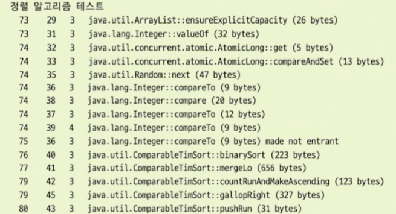
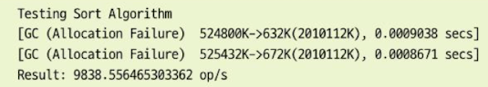
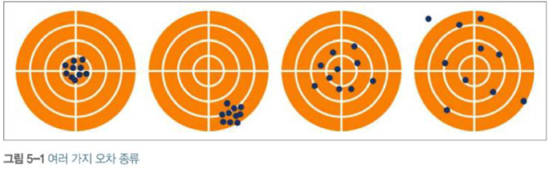
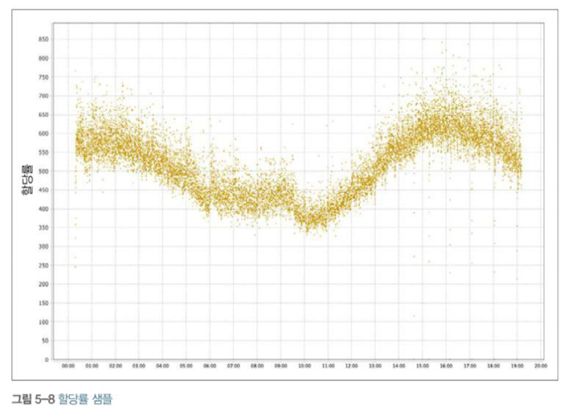
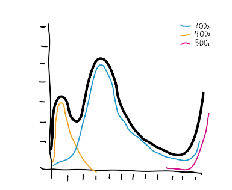

# 마이크로벤치마킹과 통계
- 작은 자바 코드 한 조각의 성능을 정확히 측정 하기란 매우 미묘하고 어려운 일이다.
## 자바 성능 측정 기초
- 벤치마크를 하나의 과학 실험처럼 바라보면 마이크로 벤치마크를 작성하는데 큰 도움이 된다.
- 이렇게 보면 벤마크란, 입출력을 지닌 일종의 블랙박스 테스트라고 할 수 있다.
  - 어떤 결과를 추측/추론 하는데 필요한 데이터를 수집하지만, 단지 데이터를 모으는 것으로는 충분하지 않고 그 데이터에 현혹되지 않게 주의 해야한다.
  - 즉 벤치마크를 통해서 데이터를 얻을때 그 수치를 너무 맹신해서도 안된다. (벤치마크에서 수치는 중요 하지 않으며 그 수치들을 어떤 모델로부터 이끌어 내느냐, 하는 점이 관건이다.)
- 사실 테스트를 정확하게 하려면 벤치마크 자체를 철저하게 통제 해야 하지만 이것은 쉽지않다 모든 코드의 실행은 컴파일러,메모리관리,서브시스템,os,하드웨어 런타임 조건등의 작용을 무시하긴 힘들다.
- 그러므로 마이크로벤치마킹이 힘든이유는 이렇게 물밑(os,하드웨어등등..)에서 작동하는 애플리케이션 코드를 떼어놓기 어렵기 때문이다.
---
## 실험 1
**실험할 예시 코드**
```java
public class ClassicSort {
    
    private static final int N = 1000;
    private static final int I = 150000;
    private static final List<Integer> testData = new ArrayList<>();
    
    public static main(String[] args) {
        Random randomGenerator = new Random();
        
        for(int i=0; i<N; i++) {
            testData.add(randomGenerator.nextInt(Integer.MAX_VALUE)); //랜덤한 정수를 리스트에 추가
        }
        System.out.println(" 테스트 시작 ");
        double startTime = System.nanoTime(); //측정 시작
        for(int i=0; i < I; i++) {
            List<Integer> copy = new ArrayList<>(testData); //list 복사후 정렬
            Collections.sort(copy);
        }
        double endTime = System.nanoTime();
        double timePerOperation = ((endTime - startTime) / (1_000_000_000L * I));
        // 각 정렬 작업에 소요된 평균 시간을 계산합니다. 이를 위해 전체 소요 시간에서 정렬 작업 횟수를 나눔
        System.out.println("결과: " + (1 / timePerOperation) + " op/s"); 
        //마지막으로, 초당 수행된 정렬 작업의 수를 계산하고 출력. 이를 계산하기 위해 1을 평균 작업 시간으로 나눕니다. 이 값이 클수록 정렬 작업이 더 빠르게 수행한 것임
    }
}
```
- 위 코드는  무작위 정수 생성후 정렬 알고리즘의 성능을 측정하는 벤치마크이다.
- 이 벤치마크의 문제는 jvm 웜업을 하지않고 진행됬다.
  - 따라서 이 코드는 실제 운영환경과는 다른 양상을 띌수도있다 웜업이 없었다는 것은 실제 테스트한 코드의 성능이 jit 컴파일러에 의해서 최적화 되지 않았을 수도 있기 때문이다. 실제로는 최적화가 될 것이기 때문에 테스트결과와는 다를수있다.
- jvm 옵션을 주어 실행해보자`java -Xms2048m -Xmx2048m -XX:+PrintCompilation ClassicSort`
  - 여기서 xms,xmx는 힙사이즈의 크기를 설정하는 옵션이다
  - PrintCompilation은 jit 컴파일러가 어떤 메서드를 컴파일 했는지 출력하는 옵션이다. 즉 다른 컴파일 이벤트가 발생할 때마다 로깅이 가능
  - 결과
    - 

  - 실험의 문제점 (통제하기 힘든 것들)
    - jvm이 가동준비를 마칠수있도록 웜업할 수있는 시간이 없음
      - 예열을 할때는 타이밍(테스트에서 코드의 실행 시간을 측정하는 것)을 하지 않은 상태로 벤치마크 대상 코드를 여러 반복 하는 식으로 예열하자
    - GC가 일어날 가능성이 큰 시점은 코드의 실행시간을 측정하지 않는 것이 가장 좋다(측정 시간이 부정확하게 길게 나올수있음)
      - 하지만 우리는 GC가 언제 일어날지 모른다 따라서 GC 이벤트에 대한 정보가 필요하다
        - GC 플래그를 확인하려면 `java -Xms:2048m -Xmx:2048m -verbose:gc ClassicSort` 를 사용하자
        - 
  - 자주 저지르는 실수
    - 테스트하려는 코드에서 생성된 결과를 실제로 사용하지 않는 것이다.
    - 현재 코드는 에서는 복사된 리스트 copy는 정렬된 후에 아무런 용도로 사용되지 않는다 이것이 문제가 될 수 있는 이유는, JIT 컴파일러가 이러한 "죽은 코드"를 식별하고 최적화하기 때문임
    - "죽은 코드"란 프로그램의 실행에 영향을 미치지 않는 코드를 의미한다. 예를 들어, 변수에 값을 할당하지만 그 값이 프로그램의 나머지 부분에서 사용되지 않는 경우 해당 코드는 "죽은 코드"로 간주될 수 있다. JIT 컴파일러는 이러한 코드를 식별하고 제거하여 프로그램의 성능을 향상시킨다.
    - 이 경우에는, JIT 컴파일러가 copy 리스트가 아무런 용도로 사용되지 않음을 식별하고, 이 정렬 작업을 완전히 제거할 수 있음. 이렇게 되면, 우리가 측정하려는 정렬 작업의 성능 측정이 실제로 이루어지지 않는다는 것을 의미한다.
    - 따라서 이 문제를 해결하기 위해서는, 복사된 리스트를 실제로 사용하는 코드를 추가해야 한다. 예를 들어, 정렬된 리스트의 첫 번째 요소를 출력하는 코드를 추가할 수 있다. 이렇게 하면 JIT 컴파일러는 정렬 작업을 제거하지 않고, 우리는 정확한 성능 측정을 얻을 수 있을 것이다.
  - 이런 문제를 파악하기 위해서 허용오차를 구하자
    - 허용오차가 너무커지면 통제 불가능한 변수가 있다고 의심할 수 있고
    - 혹은 개발된 코드 자체가 성능 기준에 미치지 못함을 의미함.
    - 예를 들어 멀티 스레드 코드 같은 경우는 벤치마킹 하기 매우 어렵고 허용오차가 크다.
  - 사실 jvm 전문가가 아닌 이상 이런 마이크로벤치마킹은 여러 변수들이 많아서 뭔가 놓치기 쉽고 이는 엉뚱한 벤치마크 결과를 얻은 가능성이 높다.
    - 따라서 마이크로벤치마킹(저수준/이러한 수치는 수집하지않거나 무시)보다는 시스템 전체를 벤치마킹하면서 전체 결과에 대해서 유의미한 결과를 얻는것이 더 좋을수도 있다.
    - 만약 저수준의 벤치마킹 결과를 유의미하게 비교하고 싶다면 JMH와 같은 전문 프레임워크를 이용해서 테스팅하자

## JMH
- 마이크로벤치마킹은 잘못되기 쉽고 통제하기 어렵다.
- 실제 애플리케이션에서 마이크로벤치마킹은 적합하지 않은 기술로 밝혀지는 경우가 많은편
### 될 수 있으면 마이크로벤치마크는 하지말자
- 건초 더미에서 바늘을 찾는 방식
- 실제 있었던 일
  - 자신이 관리하던 애플리케이션이 성능문제가 곧잘 터지곤했음 찾아보니 cpu가 100퍼센트를 찍고있었고 실핼프로파일러를 사용해서 10분동안 프로파일링 한 결과 자신이 작성한 코드는 문제가 전혀 없었고 새로 들여온 인프라 라이브러리가 화근이였음
  - 자바의 성능 문제를 어떻게 다루어야 하는지 잘보여주는 사례로 개발자는 큰 그림을 보지 못하고 자기 코드가 성능을 떨어뜨렸을 거란 강박관념에 사로 잡힘
    - 너무 작은 코드를 세세히 뜯어보면 원인을 찾기는 몹시어렵다.
### 휴리스틱 : 마이크로벤치마킹은 언제 하나?
- 자바 플랫폼은 원래 동적인 데다가 가비지 수집 및 공격적인 jit 최적화 같은 특성이 있어서 성능을 직접 가늠하기가 어렵다. 또한 런타임환경 마다 성능수치도 제각각임
- 따라서 작은 자바 코드 조각 보다는 자바 애플리케이션 전체를 대상으로 성능 분석을 하는 편이 더 수월함
- 마이크로벤치마킹을 사용해야 하는경우 3가지
  - 사용 범위가 넓은 범용 라이브러리 코드 개발시(유틸성) -> 있을 수 있음
  - OpenJDK 또는 다른 자바 플랫폼 구현체를 개발한다 -> 거의 없을 것 같음
  - 지연에 극도록 민감한 코드를 개발한다 -> 있을 수 있음
- 예시
  - 범용라이브러리는 쓰이는 컨텍스트에 관한 정보가 제한적 (즉 이 라이브러리가 어디서 쓰일지 모름 고성능 워크스테이션일수도있고 아닐수도있고 등등..)아주 폭 넓은(항목만 수십 수억개의 데이터를 다루는) 유즈케이스가 있기 때문에 나은 성능을 보여야한다.
  - 플랫폼 개발자는 마이크로벤치마크의 핵심 사용자들이다 원래 JMH도 OpenJDK 개발팀 본인들이 쓰려고 개발한 툴임
  - 이외에는 보통 저지연 금융 거래분야에 종사하는 사람들이 사용함
  - 일반적으로 가장 극단적인 애플리케이션에 한해서 사용하는것이 좋음 아래에 조건에 거의 대부분 충족하지 않는다면 마이크로벤치마킹을 해도 진정한 가치 있는 결과를 얻기힘듦
    - 총 코드 경로 실행시간이 적어도 1ms, 실제로는 100ms보다 짧아야함
    - 메모리 할당률을 측정할때 그 값이 1MB/s보다 미만, 가급적 0에 가까운 값이어야한다.
    - 100%에 가깝게 Cpu를 사용하며 시스템 이용률은 낮게 (10% 밑) 유지해야한다.
    - 실행 프로파일러로 Cpu를 소비하는 메서드들의 분포를 이해해야 한다. 분포 그래프에서 지배적인 영향을 끼치는 메서드는 많아야 두세개임
  - 이런 분야에서는 마이크로벤치마크를 사용하는 것이 합리적임 이외에 일반 개발자들이라면 시스템 성능 요건이 정말 마이크로벤치마크를 고려해야 할 정도인지 고민해봐야함
- 종합 하면 사실 마이크로벤치마킹은 거의 필요없는 고급기법이지만 마이크로벤치마킹 일부 이론과 복잡성은 잘알아두는 것이 좋다. 그래야 극단적이지 않은 자바 애플리케이션을 자바 플랫폼위에서 성능 작업을 하는것이 얼마나 고된것인지 알게될 것이기 때문임
### JMH 프레임워크
- JMH는 자바를 포함해서 JVM을 타깃으로 하는 언어로 작성된 나노/마이크로/밀리/매크로 벤치마크를 제작,실행,분석 하는 자바 도구
- JMH는 앞서 설명한 핵심적인 설계 이슈를 고려해서 만들어진 프레임워크다.
- 벤치마크 프레임워크는 컴파일 타임에 벤치마크 내용을 알 수 없기 때문에 동적이여야 하고 리플렉션을 사용해서 우회하는 방법도 있지만 리플렉션을 사용하면 벤치마킹 실행 경로에 복잡한 jvm 서브시스템이 하나 더 끼어들게 되는 셈이다
  - 따라서 JMH는 벤치마크 코드에 애노테이션을 붙여 자바소스를 추가로 생성하는 식으로 작동한다.
  - 또한 유저가 코드를 많이 반복할경우에도 루프 최적화를 걸리지 않을 정도로 반복횟수를 설정해준다.
### 벤치마크 실행
- 벤치마크클 실행 시킬 메서드에는 `@Benchmark` 어노테이션을 붙이자
- 벤치 마크를 진행할때는 데이터셋 또는 성능 비교용 대조군에 필요한 조건 세팅등의 설정 작업을 해야함
- JMH 프레임워크는 상태를 제어하는 기능을 제공한다 `@State` -> enum Scope를 가짐
  - Benchmark
  - Thread
  - Group
- 일반적으로 JVM은 메서드 내에서 실행된 코드가 부수효과를 전혀 일으키지 않고 그 결과를 사용하지 않을 경우 해당 메서드를 삭제 대상으로 삼는다.
- ex) 즉 복잡한 연산결과를 테스트내에서 아무런 곳에서도 사용하지 않을 경우 연산자체를 안할수도 있다.
    ``` java
    public void test() {
      int result;
      // 엄청 복잡한연산
      result = 복잡한연산의 결과
    }
    ```
- 이런현상을 방지하기 위해서 JMH 에서는 단일 결괏값을 암묵적으로 블랙홀 이라는 곳에 할당한다 즉 위의 예시에서는 result를 사용하게 하는것 이다. 이작업은 오버헤드가 거의 없어서 안심해도된다.

<details>
<summary>챗지피티 답변</summary>
Java Microbenchmark Harness(JMH)는 Java에서 미세 벤치마킹을 수행하는 데 사용되는 도구입니다.
<BR>
JMH는 JVM의 Just-In-Time(JIT) 컴파일러와 같은 런타임 최적화로 인해 발생하는 문제를 해결하는 여러 가지 방법을 제공합니다.
<BR>
일반적으로, JVM의 JIT 컴파일러는 사용되지 않는 코드를 찾아 제거하는 "dead code elimination" 최적화를 수행합니다.
<BR>
그러나 이것은 벤치마킹 상황에서 문제가 될 수 있습니다.
<BR>
왜냐하면, 벤치마킹을 수행하려는 코드가 실제로는 중요하지만 JIT 컴파일러에 의해 사용되지 않는 코드로 간주되어 제거될 수 있기 때문입니다.
<BR>
JMH는 이 문제를 해결하기 위해 Blackhole.consume() 메소드를 제공합니다.
<BR>
이 메소드는 인자로 주어진 값을 사용하여 "아무것도 하지 않음"을 시뮬레이션합니다. 이를 사용하면, JVM은 해당 값을 계산하는 데 드는 비용을 측정할 수 있지만, 최적화 과정에서 해당 코드를 제거하지 않습니다.
<BR>
다음은 Blackhole.consume() 메소드를 사용하는 예입니다:
<BR>
<pre><code>
import org.openjdk.jmh.annotations.Benchmark;
import org.openjdk.jmh.annotations.BenchmarkMode;
import org.openjdk.jmh.annotations.Mode;
import org.openjdk.jmh.infra.Blackhole;
public class MyBenchmark {
    @Benchmark
    @BenchmarkMode(Mode.AverageTime)
    public void testMethod(Blackhole blackhole) {
        int a = 10;
        int b = a * 2;
        blackhole.consume(b); // This prevents "int b = a * 2;" from being considered as dead code.
    }
}
</code></pre>
<BR>
위의 코드에서 Blackhole.consume(b); 라인은 b 값을 계산하는 데 드는 비용을 측정하면서 동시에 해당 코드가 JIT 컴파일러에 의해 제거되는 것을 방지합니다.
</details>


- 블랙홀은 어떨때 사용하면 좋을까 ??
  - 계산량이 많은 벤치마크는 메서드의 결과를 조합해서 반환하는 비용을 무시못하기 때문에 이럴때 그냥 결과를 블랙홀에 넣어버리면 된다.
- 과최적화를 방지해주는 블랙홀의 네가지 장치
  - 런타임에 죽은 코드를 제거하는 최적화를 못하게 막음
  - 반복되는 계산을 상수 폴딩 하지않게 만든다 -> 컴파일러가 컴파일 타임에 미리 계산가능한 표현식을 상수로 바꾸어 최적화 하는과정을 말함
  - 값을 읽거나 쓰는 행위가 캐시 라인에 영향을 끼치는 잘못된 공유 현상을 방지
  - 쓰기 장벽으로 부터 보호
- 장벽이란 ?
  - 일반적으로 리소스가 포화돼서 사실상 애플리케이션에 병목현상을 초래하는 지점을 말함
  - 이렇게 쓰기 장벽에 이르면 캐시에 영향을 미치고 쓰기 전용버퍼가 오염되서 벤치마킹이 제대로 안됌
- JMH는 JVM과 아주 밀접하게 맞닿아 작동한다 따라서 컴파일러를 제어하고 벤치마크 도중 cpu 사용수준을 시뮬레이션한다.
- JVM이 인라이닝 또는 컴파일 할때 성능이슈가 발생한 것으로 의심될경우 @CompilerControl 어노테이션을 사용해서 컴파일러에게 힌트를 줄수있다.
  - @CompilerControl(CompilerControl.Mode.DONT_INLINE) -> 인라이닝을 하지마라
  - @CompilerControl(CompilerControl.Mode.EXCLUDE) -> 컴파일을 하지마라
  - @CompilerControl(CompilerControl.Mode.INLINE) -> 인라이닝을 해라

<details>
<summary>가비지 컬렉션?</summary>
<pre>
가비지 컬렉션 할당률(Garbage Collection Allocation Rate)은 일정 시간 동안 가비지 컬렉션에 의해 수집되는 객체의 메모리 총량을 나타냅니다.
이는 주로 MB/sec 등의 단위로 표현되며, 시간당 생성되는 가비지의 양을 나타냅니다.
가비지 컬렉션(Garbage Collection, GC)은 동적으로 할당된 메모리 중에서 더 이상 사용되지 않는 부분을 자동으로 회수하는 과정을 말합니다.
자바와 같은 언어에서는 가비지 컬렉션을 통해 개발자가 명시적으로 메모리를 관리하는 부담을 줄일 수 있습니다.
하지만, GC는 CPU 시간을 소비하므로, 더 많은 가비지가 생성될수록 GC가 더 자주 발생하고, 이는 애플리케이션의 성능에 영향을 미칠 수 있습니다.
따라서, 가비지 컬렉션 할당률은 일반적으로 낮을수록 좋습니다.
즉, 프로그램이 적은 양의 가비지만 생성하면 GC의 부하가 줄어들고, 이는 애플리케이션의 전반적인 성능 향상으로 이어질 수 있습니다.
하지만 이는 상황에 따라 다르며, 가비지 컬렉션 할당률 외에도 다른 성능 지표들을 함께 고려하여 애플리케이션의 전반적인 성능을 평가해야 합니다.
</pre>
</details>

## JVM 성능 통계
### 오차 유형
- 엔지니어가 자주 접하는 오차의 주된 근원 두가지
  - 랜덤 오차 : 측정 오차 또는 무관계 요인이 어떤 상관관계 없이 결과에 영향을 미친다.
  - 계통 오차 : 원인을 알 수 없는 요인이 상관관계 있는 형태로 측정에 영향을 미친다.
- 정확도가 높으면 계통오차가 낮음
- 정밀도가 높으면 랜덤오차가 낮음
- 그림 예시
  - 
  - 첫번째 정확도,정밀도 둘다높음
  - 두번째 탄착군은 한곳에 몰려있지만 영점조정이 안됬음 즉 정밀도는 높고 정확도는 낮음
  - 세번째 정확도는 높고 정밀도가 낮은 경우
  - 네번째 정확도, 정밀도 둘 다 낮은 경우
- **계통 오차**
  - 런던에 있는 서버에 부하를 주고 테스트 해야되는데 실제 테스트는 인도 뭄바이에서 했을 때
  - 테스트 환경이나 테스트 자체가 잘못됬을때 발생
- **랜덤 오차**
  - 랜덤 오차는 원인을 알 수 없는, 혹은 예기치 못한 환경상의 변화 때문에 일어난다.
  - 랜덤오차는 대부분 정규 분포를 따른다
- **허위 상관**
  - 상관은 인과를 나타내지 않는다.
  - 즉 두변수가 비슷하게 움직인다고해서 꼭 두변수에 연결관계가 있는것은아니다.
  - 오히려 아무관계도 없는 측정값에도 뜯어보면 상관관계가 발견되는 경우가 종종있다.
  - 마찬가지로 JVM도 그럴싸해 보이는 연결고리와 상관관계만 보고 측정값이 인과관계를 넘겨짚지 않도록 항상 주의하자
### 비정규 통계학
- 이미 고객 상당수가 불만을 제기하는 상황이 아니라면, 평균 응답 시간 단축이 목표가 될 일은 거의 없다.

<details>
<summary>고동적 범위 분포, 긴 꼬리형 분포, 트랜잭션 시간 분포도 에 대한 설명</summary>
<pre>
"긴 꼬리형 분포"는 데이터의 분포 형태를 설명하는 말로, 이는 대부분의 데이터가 특정 값 주변에 집중되어 있고, 아주 드물게 그보다 훨씬 크거나 작은 값을 가진 데이터들이 있는 분포를 말합니다.
이런 분포는 그래프를 그렸을 때 한쪽 꼬리가 길게 늘어져서 '긴 꼬리'라는 이름이 붙었습니다.
이는 비정규 분포의 한 형태로, 평균값 주변에 데이터가 밀집되어 있는 정규 분포와는 다르게 보입니다.
고동적 범위 분포(highly dynamic range distribution)와 트랜잭션 시간 분포(transaction time distribution)는 이 "긴 꼬리형 분포"의 특징을 가지고 있는 경우가 많습니다.
<BR>
고동적 범위 분포: 이는 데이터의 값이 매우 작은 수치부터 매우 큰 수치까지 다양하게 분포해 있는 경우를 말합니다.
예를 들어, 인터넷 사이트의 페이지 뷰 수를 생각해 보세요. 대부분의 웹페이지는 적은 수의 페이지뷰를 가지지만, 몇몇 인기있는 페이지(예를 들어, 홈페이지나 특정 뉴스 기사 등)는 굉장히 높은 페이지뷰를 가집니다. 이런 경우, 페이지 뷰의 분포는 '긴 꼬리'를 가진 형태가 됩니다.
<BR>
트랜잭션 시간 분포: 이는 트랜잭션을 처리하는 데 걸리는 시간의 분포를 말합니다. 대부분의 트랜잭션은 빠르게 처리되지만, 복잡하거나 큰 용량의 트랜잭션은 처리 시간이 길어질 수 있습니다.
이런 경우에도, 트랜잭션 시간의 분포는 '긴 꼬리'를 가진 형태를 보이게 됩니다.
<BR>
이 두 분포가 긴 꼬리형 분포와 관련이 있는 이유는, 사회 현상이나 시스템의 성능 등 많은 현상에서 '긴 꼬리' 형태의 분포를 보이기 때문입니다.
이런 분포를 이해하고 분석하는 것은, 예를 들어 시스템의 성능을 최적화하거나, 사용자의 행동 패턴을 이해하는 데 중요합니다.좋습니다.
즉, 프로그램이 적은 양의 가비지만 생성하면 GC의 부하가 줄어들고, 이는 애플리케이션의 전반적인 성능 향상으로 이어질 수 있습니다.
하지만 이는 상황에 따라 다르며, 가비지 컬렉션 할당률 외에도 다른 성능 지표들을 함께 고려하여 애플리케이션의 전반적인 성능을 평가해야 합니다.
</pre>
</details>

<details>
<summary>대수 백분위수</summary>
<pre>
"대수 백분위수"는 로그 분포에서 백분위수를 구하는 방법입니다.
일반적으로, 백분위수는 데이터를 오름차순으로 정렬했을 때 어느 위치에 있는 값을 찾는 방법을 말합니다.
예를 들어, 중앙값은 50번째 백분위수, 즉 데이터의 중앙에 있는 값을 말하며, 하위 25%를 가리키는 값이 1사분위수, 상위 25%를 가리키는 값이 3사분위수입니다.
<BR>
그러나 데이터가 로그 분포와 같이 '긴 꼬리'를 가진 분포를 보일 때는 일반적인 백분위수가 그리 유용하지 않습니다. 이런 분포에서는, 대수 백분위수가 더 효과적인 분석 도구가 될 수 있습니다.
대수 백분위수를 구하려면, 먼저 모든 데이터에 로그 변환을 적용합니다.
이렇게 하면 '긴 꼬리' 분포가 보다 대칭적인 형태로 변환되어 분석하기 쉽게 됩니다. 그런 다음 이 로그 변환된 데이터에 대해 일반적인 백분위수를 계산합니다.
<BR>
예를 들어, 대수 중앙값은 로그 변환된 데이터의 중앙값을 말합니다. 이 값은 원래 스케일로 되돌리려면 역로그를 취하면 됩니다.
이런 방법으로, '긴 꼬리' 분포의 중심 경향성이나 변동성을 더 잘 설명하는 값을 얻을 수 있습니다.
</pre>
</details>

## 통계치 해석
- 메모리 할당률 측정 그래프
  - 
  - 할당 데이터는 비교적 신호가 명확해서 해석이 쉽다
  - 9~10시간 사이 바닥을 치고 다시 증가하는 것을 보아 GC가 발생했음을 알 수 있다
  - 할당률은 애플리케이션이 실제로 수행 중인 작업량을 반영하므로 시간대별로 측정값의 차이가 난다 => 시간대별 유저의 접속량에 따른 메모리 할당량이 다름
  - 하지만 실제의 경우 이것보다 훨씩 복잡해짐
- HTTP 요청 - 응답 시간을 측정한 히스토그램
  - 
  - 400대 같은경우는 대부분 곧바로 응답을 주기때문에 위와 같은 모습 이다.
  - 500대 같은경우는 서버가 장기간처리(외부서비스 호출,리소스부하로 인한 타임아웃 등등)로 인해 발생하는 편이라 위와 같은 모습이다.
  - 위처럼 일반적인 측정값을 유의미한 하위 구성요소들로 분해하는 것은 매우 유용하다 (http요청응답을 성공,400,500으로 분해)
    - 더 작은경우로 쪼개야 하는 경우가 있는데 위를 예시로 들면 성공요청이라도 업데이트,업로드요청과 읽기요청은 서로 다른분포를 보일 것임
  - 분석자는 결과 값을 보고 결론을 도출하기 전에 본인의 데이터 및 도메인을 충분히 이해하고 숙지 하고 있어야 한다.( 당연한 말이다 )
## 정리

- 유즈케이스를 확실히 모르는 상태에서는 마이크로벤치마킹을 하지말자
- 그래도 해야한다면 JMH를 사용하자
- 얻은 결과를 가능한 많은 사람과 공유하고 동료들과 의논하자
- 항상 잘못될 가능성을 염두해두고 자신의 생각을 검증하자
