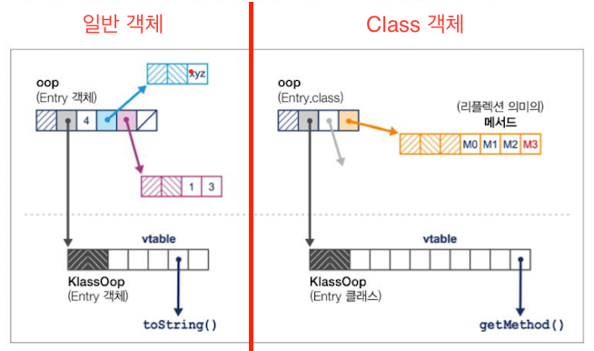
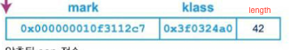
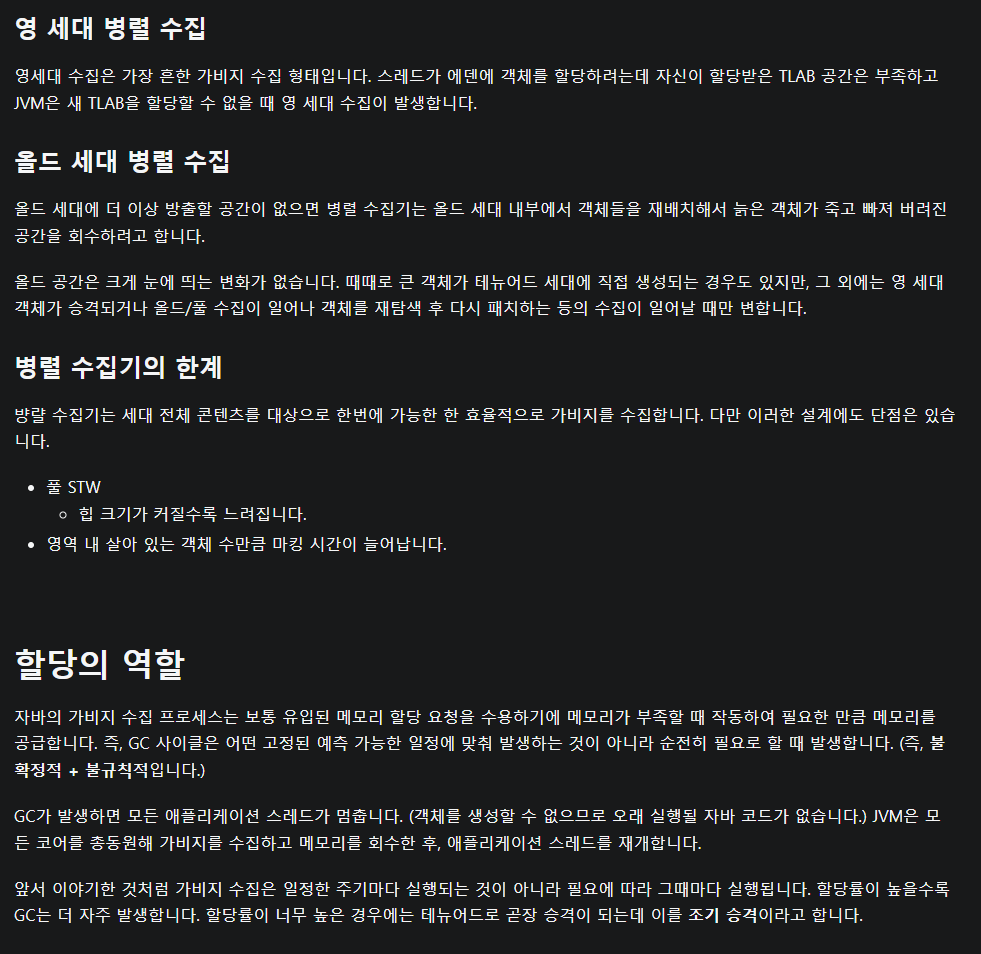

# 가비지 수집 기초
- GC는 초창기에 상당한 반감을 삿었음
  - 언어 수준에서 의도적으로 GC를 제어하지 못하게 만들었기 때문에
- 하지만 이덕분에 자바의 인지도가 올라가기도 했고 최근 들어서는 메모리 관리는 프로그래머가 아닌 컴파일러,런타임 영역이랑 보는 시각이 많음
- GarbageCollector의 구현체는 이 두가지 원칙을 준수해야함 (여기서는 두번째 원칙이 훨씬 중요하다)
  - 알고리즘은 반드시 모든 가비지를 수집해야 한다.
  - 살아 있는 객체로는 절대로 수집해서는 안된다.
## Mark and Sweep
- 자바의 가장 기초적인 가비지 수집 알고리즘
- Mark and Sweep 알고리즘 순서
  - 할당 리스트를 순회하면서 마크 비트를 지운다.
  - GC 루트로부터 살아 있는 객체를 찾는다.
  - 이렇게 찾은 객체마다 마크 비트를 세팅한다.
  - 할당 리스트를 순회하면서 마크 비트가 세팅되지 않은 객체를 찾는다.
    - 힙에서 메모리를 회수해 프리리스트에 되돌린다.
    - 할당 리스트에서 객체를 삭제한다.
  - 이 알고리즘은 dfs로 실행된다.
### GC 용어
- STW (Stop The World)
  - GC를 실행하기 위해 JVM이 애플리케이션 실행을 멈추는 것
  - GC가 실행되는 동안에는 애플리케이션 스레드가 실행되지 않는다.
  - 모든 코어를 이용해 빠르게 GC를 실행하기 위함
- 동시
  - GC스레드는 애플리케이션 스레드와 동시 실행될 수 있다.
  - 하지만 아주어렵고 비싼 작업이면 100% 동시실행을 보장하는 알고리즘은 없고 비슷한 알고리즘은 있다.
  - CMS (Concurrent Mark and Sweep)는 동시 알고리즘의 대표적인 예지만 이 알고리즘도 100% 동시가 아니라 조금의 STW가 존재함
- 정확
  - GC 스키마는 전체 가비지를 한방에 수집할 수 있게 힙 상태에 관한 충분한 타입 정보를 지니고 있다.
  - 대략 적으로 int와 포인터의 차이점을 언제나 분간할 수있는 속성을 지닌 스키마가 정확한 것
- 보수
  - 보스적인 스키마는 힙 상태에 관한 충분한 타입 정보를 지니고 있지 않다.
  - 따라서 리소스를 낭비하는 일이 잦고 근복적으로 타입 체계를 무시한다.
- 이동
  - 이동 수집기에서 객체는 메모리를 여기저기 오갈 수 있음
  - 객체 주소가 고정된 것이 아님 (가상,TLSB,영역구분)
- 압착
  - 할당된 메모리는 GC 사이클 마지막에 연속된 영역인 배열이며 포인터가 있음
  - servivor 영역에서 1,2를 계속 왓다갓다(압착) 하며 비우는것 같음
- 방출
  - 수정 사이클 마지막에 할당된 영역을 완전히 비우고 살아남은 객체는 다른 메모리 영역으로 방출함

## 핫스팟 런타임 개요
- 자바는 C++과는 달리 주소를 역참조 하는 일반적인 매커니즘이 존재하지 않음
- 대신 오프셋(.) 연산자를 이용해서 필드에 엑세스 하거나 객체 레퍼런스의 메서드를 호출할 수 있음.
- 객체 레퍼런스의 경우에 복사된 **'값'** 이 힙에 있는 객체의 주소
### 객체를 런타임에 표현하는방법
- 핫스팟은 런타임에 oop 라는 구조체로 자바 객체를 나타낸다.
- **oop(ordinary object pointer) 란?**
  - oop는 참조형 지역 변수 안에 위치한다. (객체 포인터)
  - 자바 메서드 스택프레임으로부터 자바 힙을 구성하는 메모리 영역을 가리킴 
  - 여기서 자바 메서드의 스택 프레임으로부터 자바 힙을 구성하는 메모리 영역의 내부를 가리킨다.
  - 압축 가능
    - 압축기능을 끄면 성능이 개선 되기도 함 근데 효과는 미미함
  - ```
    oop (추상 베이스)
     instanceOop (인스턴스 객체)
     methodOop (메서드 표현형)
     arrayOop (배열 추상 베이스)
     symbolOop (내부 심볼 / 스트링 클래스)
     klassOop (Klass 헤더) (자바 7 이전만 해당)
     markOop
    ```
- **instanceOop란 ?**
  - oop 자료구조 중에 자바 클래스의 인스턴스를 나타내는 포인터
  - 모든 객체에 대해 기계어 워드 2개로 구성된 헤더로 시작한다
    - mark 워드(인스턴스 관련 메타데이터를 가리키는 포인터), klass 워드(클래스 메타데이터를 가리키는 포인터)
    - 자바 7까지는 instanceOop의 klass 워드가 자바힙의 일부인 펌젠 이라는 메모리 영역을 가리켰습니다.
    - 자바 힙에 있는 건 모두 객체 헤더를 갖고 다녀야 했고 메타데이터를 klassOop로 참조했음.
    - 자바 8부터는 klass 워드가 힙 영역 밖으로(jvm 힙밖은아님) 빠져서 klass 워드가 자바 힙 밖(Metaspace)을 가리키므로 객체 해더가 필요없음

      

- JVM 환경에서 자바 레퍼런스는 instanceOop를(또는 null) 제외한 어떤 것도 가리킬 수 없음 저수준에서는 이런의미임
  - 자바 값은 기본형 값 또는 instanceOop 주소트레퍼런스)에 대응되는 비트 패턴임
  - 모든 자바 레퍼런스는 자바 힙의 주 영역에 있는 주소를 가리키는 포인터입니다.
  - 자바 레퍼런스가 가리키는 주소에는 Mark 워드와 Klass 워드가 들어있습니다.
  - klassOop와 Class<?> 의 인스턴스는 다르며 klassOop(힙의 메타데이터 영역에 있음)을 자바 변수에 넣을 수 없습니다.
    - Klass 워드 다음에 배열 길이를 나타내는 Length워드가 붙어있음
       (klassOop)
### GC 루트 및 아레나
- GC 루트
  - GC 루트는 메모리의 고정점(앵커 포인트, anchor point)으로 `메모리 풀 외부에서 내부를 가리키는 포인터`
  - 종류
    - 스택 프레임(stack frame)
    - JNI
    - 레지스터(호이스트된 변수)
    - 코드 루트
    - 전역 객체
    - 로드된 클래스의 메타데이터
  - 쉽게 말해 stack 에있는 지역 변수도 힙에 있는 객체를 갈리키는 포인터이므로 가장 단순한 형태의 GC 루트라고 생각하면된다.
  - 핫스팟 GC는 아레나 라는 메모리 영역에서 작동한다
  - 핫스팟은 자바 힙을 관리할 때 시스템 콜을 하지 않는다


